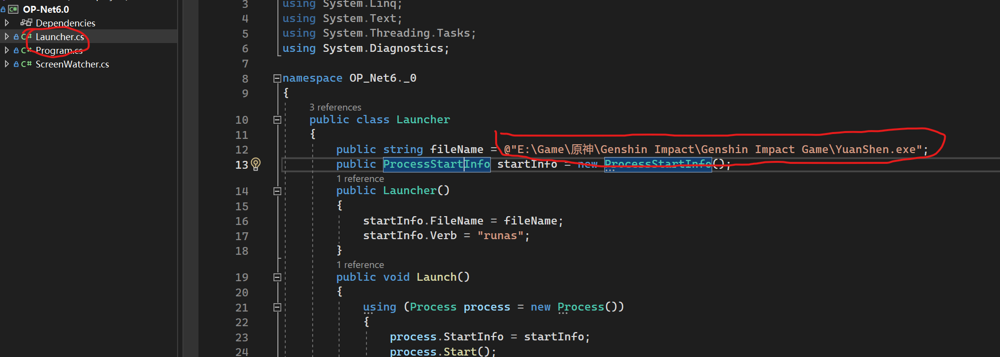
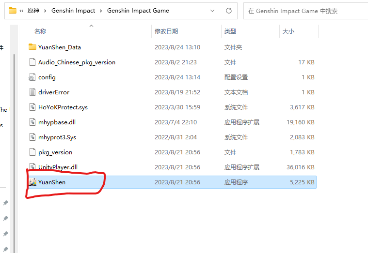
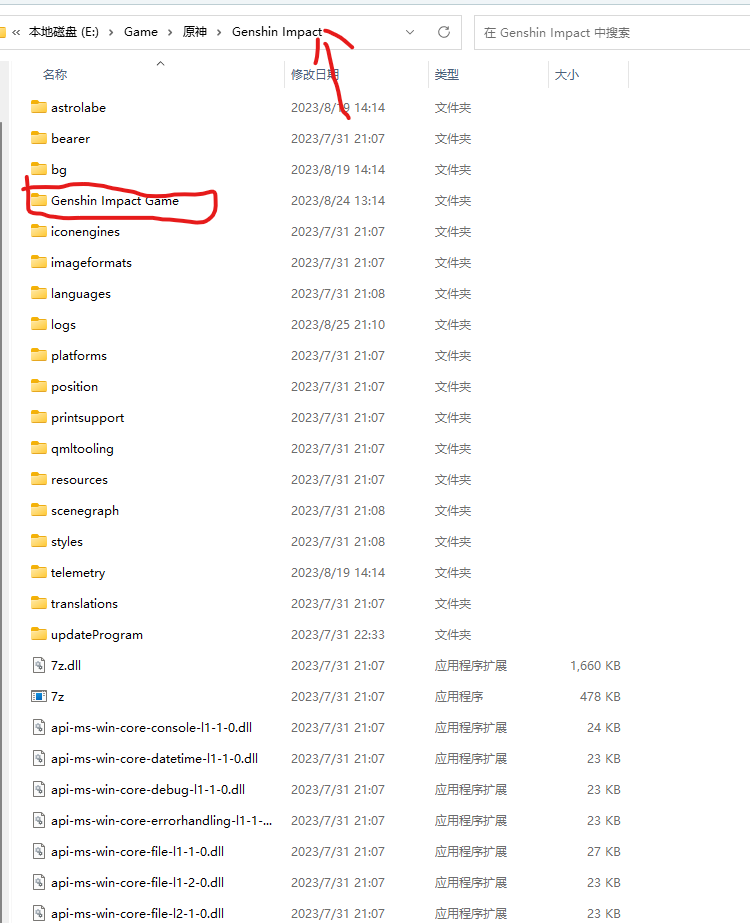
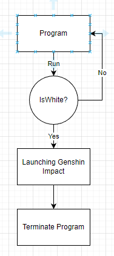

# A screen-detection-based way to launch Genshin Impact (White)

## README.md

- [简体中文](./readme/README.zh_CN.md)

- [English](README.md)

## Introduction

Keep the program as simple as possible. Idealy, detect whole screen that is white then launch the Genshin Impact. However, we have to consider lots of things. So replace the entire screen is white idea with **detecting the first pixel is white** method (Maybe I'll updata it later, maybe not XD).  Have fun XD 

## Configuration

- Change Genshin Imact File address
  

change my address to your Genshin Impact address.

step 1: Go to your installation address.  Click "Genshin Impact Game" folder (See the picture below).

Step 2: Copy the address. (Left click once, then Ctrl + Shift + C. Or right click once, then copy the address)

## Run the program

Make sure to run as **administrator**. Otherwise, error.

How to run as administrator Eg:

1. Right Click Visual Studio

2. Find and Click "Run as adminstrator"

3. Done!

## Program lifecycle

## Caution

Note !!  This is a MVP (Minimal Variable Product), this program works, but it's not optimized. 

When the progress from "A" to "Genshin Impact", the "A" progress is still running.

So, before running this program, please make sure your compute has a good performance. Otherwise, I am not sure your computer would crash.  

