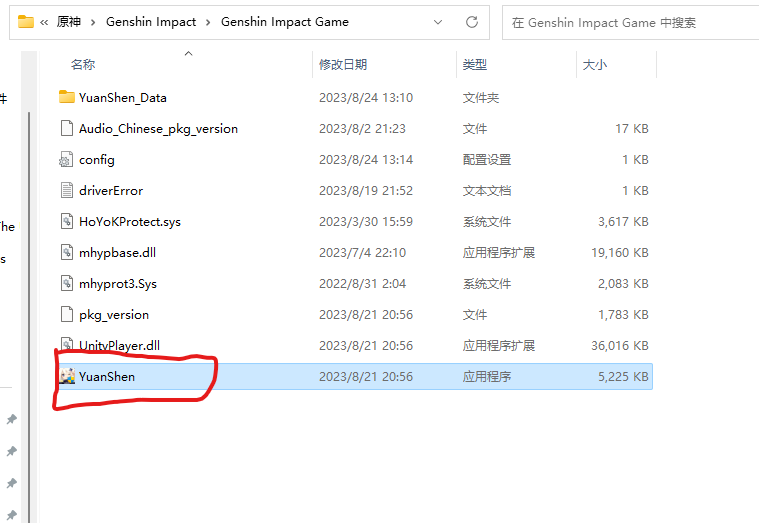
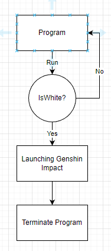

## 一项基于屏幕检测的启动原神方式(白色)

## README.md

- [简体中文](readme/README.zh_CN.md)

- [English](../README.md)
  
  

## 介绍

原本是要检测整个屏幕是白色的， 但是不想搞那么麻烦。这是因为要考虑屏幕分割，多进程等东西，就怎么简单怎么来。检测电脑屏幕的第0个像素也就是左上角的第一个像素为**白色**则运行该程序。后面说不定会搞监测整个屏幕的方法。

## 配置

- 修改原神地址
  

把我的 fileName = @"{你的文件地址}" 方法看下面

step 1: 去到你下载原神的地址，并且进入 "Genshin Impact Game" 地址（看下图）.

  

Step 2: 复制下面原神启动地址. (左键点一次, 然后 Ctrl + Shift + C. 或者右键一次, 然后复制其地址)

  

## 启动项目

确保你以管理员身份去跑

怎么用管理员身份呢？ 如:

1. 右键点击 Visual Studio

2. 找到并点击"以管理员身份运行"

3. 搞定！

## 生命周期

  

## 注意

该程序可以运行，但未优化。

因此，在运行此程序之前，请确保您的计算性能良好。否则，我不确定你的电脑会不会死机。
